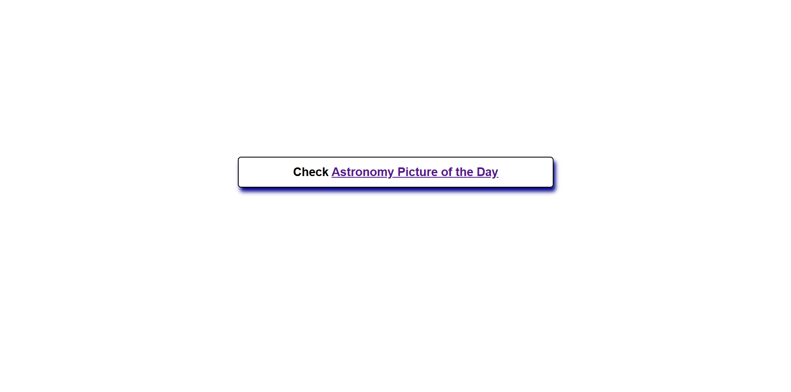
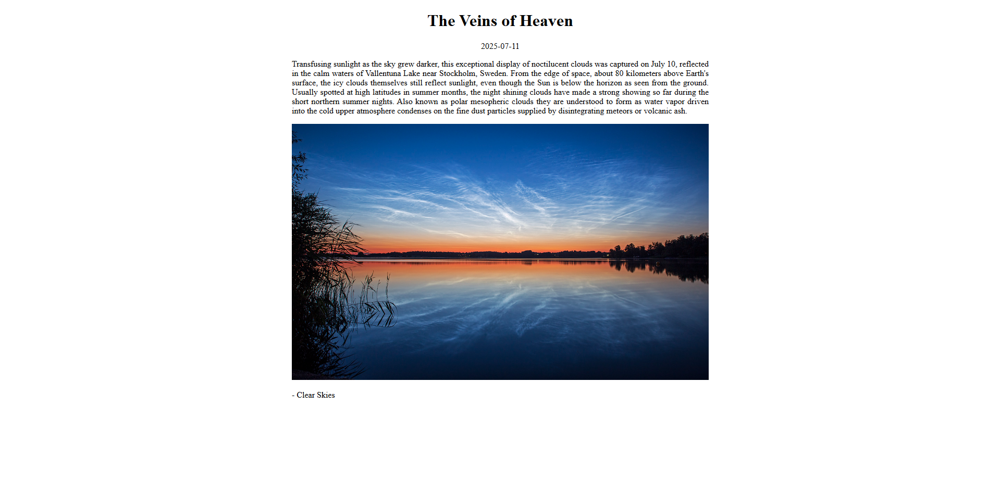

# NASA's APOD API Personal Project

## Showing the Astronomy Picture of the Day in a WebPage with SpringBoot

### Description

There are two paths, both via GET requests: 
- ```/```:
The "home" page, showing the link to the next path.

- ```/apod```:
The "main" page, where the content appears. When reached, it is made a GET request to the API, and renders the page according to the content returned.

I tried to keep track of the number of requests made within 24 hours, with the files inside ```data/```, so, it would only send the request if the number of
requests made since the last time it was reset is less than the defined as the limit. 
If a request is made and 24 hours already passed after the first time is was reset, the number of requests made is (re)set to 0.

<hr>

### Main Purposes
- Practice coding with the Spring Framework;
- Learn DTOs usage;
- Practice Controllers mapping methods;
- Using Thymeleaf for dynamic HTML rendering;
- Using external APIs;
- Using Spring Web's functionalities;

### Other Purposes
- Manipulating files with Java/Spring:

  In the folder ```data/```, there are two files, ```count.txt``` and ```last-reset.txt```.
  They were created to manipulate the number of requests made by the application,
  and when to let the request be made, or block it, or reset it (Just for the sake of it).

<hr>

### Screenshots

- GET ```/```



- GET ```/apod```


<hr>

#### See NASA's Open APIs at [https://api.nasa.gov/](https://api.nasa.gov/)

<hr>

##### By [Héber Lemes](https://github.com/HeberFHLemes)
